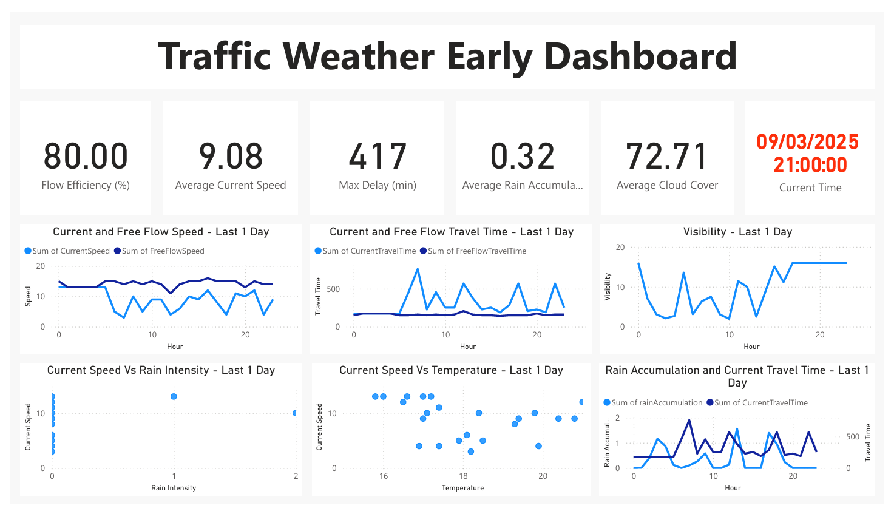

# Live Traffic and Weather Dashboard

[](https://www.python.org/)
[](LICENSE)
[](https://powerbi.microsoft.com/)

This project is a dashboard that fetches and visualizes **live traffic and weather data**, updating hourly via a scheduled pipeline and Windows Task Scheduler.

---

## Features

- Fetches **traffic data** from Google Cloud via a Cloud Function and stores results in Google Cloud Storage.
- Fetches **local weather data** from your PC automatically.
- Hourly updates via a scheduled pipeline.
- Visualized using **Power BI**.
- Includes **pipeline sketch** and **dashboard screenshot** for clarity.

---

## Tech Stack

- **Python**: Cloud Functions, data fetching, pipeline orchestration  
- **Power BI**: Dashboard visualization  
- **Libraries**:
  - `pandas`
  - `XlsxWriter`
  - `google-cloud-storage`

---

## Images

### Pipeline Overview


### Dashboard Example


---

## Setup Instructions

1. **Clone the repository**

```bash
git clone https://github.com/yourusername/live-traffic-weather-dashboard.git
cd live-traffic-weather-dashboard
Install Python dependencies

bash
Copy code
pip install -r requirements.txt
Configure API keys and settings

Copy config.example.json to config.json.

Fill in your credentials (Google Cloud API keys, local weather API key, GCS bucket name, etc.).

Important: Do not commit config.json to GitHub.

Run locally

bash
Copy code
python src/pipeline.py
This will fetch both traffic and weather data and save them as Excel files.

Scheduling
The pipeline is scheduled via Windows Task Scheduler to run hourly.

Ensure the scheduled task points to src/pipeline.py and uses the correct working directory.

Project Structure
bash
Copy code
live-traffic-weather-dashboard/
│
├── src/
│   ├── api_cloud.py       # Fetch traffic data and upload to GCS
│   ├── api_local.py       # Fetch weather data locally
│   ├── pipeline.py        # Orchestrates hourly fetch
│   └── dashboard.py       # Optional preprocessing for Power BI
│
├── images/                # Project images
│   ├── pipeline_sketch.png
│   └── dashboard_view.png
│
├── requirements.txt
├── README.md
├── .gitignore
├── config.example.json
└── LICENSE
License
This project is licensed under the MIT License. See LICENSE for details.